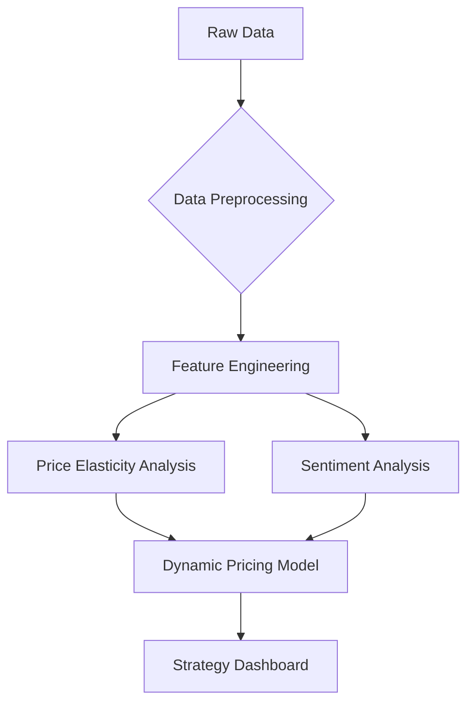
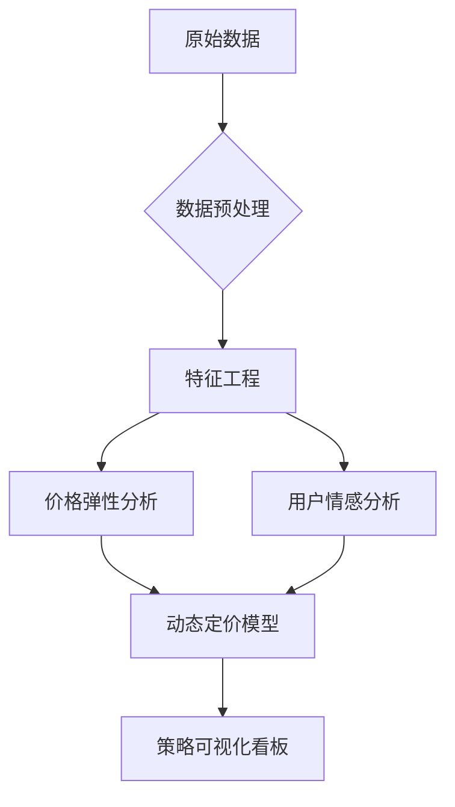

# Cross-border E-commerce Pricing Strategy Optimization / 跨境电商产品定价策略优化

[](https://www.python.org/downloads/)
[](https://opensource.org/licenses/MIT)
[](https://streamlit.io)

[English](#english) | [中文](#chinese)


### Overview
An interactive dashboard for analyzing Amazon product data, with a focus on price elasticity, customer reviews, and market trends.

### Project Structure
```
amazon-product-analysis/
├── data/                # Data files
│   └── amazon.csv
├── src/                 # Source code
│   ├── data_preprocessing.py
│   ├── price_elasticity.py
│   ├── sentiment_analysis.py
│   ├── pricing_model.py
│   └── dashboard.py
├── outputs/             # Analysis results
│   └── report.txt
├── docs/               # Documentation
│   └── images/
├── requirements.txt    # Dependencies
└── README.md
```

### Features
- 📊 Market Overview
  - Key metrics and market indicators
  - Price distribution analysis
  - Rating distribution visualization

- 💰 Price Analysis
  - Price elasticity calculation
  - Price-demand relationship
  - Correlation analysis

- 📝 Review Analysis
  - Sentiment analysis
  - Keyword extraction
  - Review trends visualization

### Business Background
With the rapid growth of the Indian e-commerce market, the 3C accessories category faces intense price competition. This project focuses on cable products (charging/data cables) and uses data analysis and machine learning to optimize pricing strategies to achieve:

- 🚀 Identify price-sensitive groups
- 💡 Quantify price elasticity
- 📊 Build dynamic pricing models
- 📈 Increase overall gross margin by 15-20%

### Core Value
```text
├── Precise pricing recommendations → Improve conversion rate
├── Inventory optimization → Reduce dead stock by 30%
└── Competitor monitoring → 50% faster price response
```

### Technical Architecture


### Dataset
- Amazon India cable category product data (including price/reviews/ratings)
- **Field descriptions**:
  ```python
  product_id        # Unique product identifier
  discounted_price  # Discounted price (₹)
  actual_price      # Original price (₹)
  rating_count      # Number of ratings (sales proxy)
  review_content    # User review text
  product_name      # Product name (includes length/brand info)
  ```

### Sample Data
| product_id | discounted_price | rating | rating_count | review_content               |
|------------|------------------|--------|--------------|------------------------------|
| B08HDJ86NZ | 329              | 4.2    | 94,363       | "Fast charging, good quality..." |

### Requirements
- Python 3.8+
- RAM ≥ 8GB
- Required packages:
  - Streamlit
  - Pandas
  - Plotly
  - NLTK
  - WordCloud
  - NumPy

### Quick Start
1. Clone the repository
```bash
git clone https://github.com/yourusername/amazon-product-analysis.git
cd amazon-product-analysis
```

2. Install dependencies
```bash
pip install -r requirements.txt
```

3. Run the dashboard
```bash
streamlit run src/dashboard.py
```

### Core Analysis
#### Price Elasticity Model
```python
# Code snippet
from sklearn.linear_model import ElasticNet

model = ElasticNet(alpha=0.5, l1_ratio=0.7)
model.fit(X_train, y_train)
print(f"Price elasticity coefficient: {model.coef_[0]:.2f}")
```

#### Sentiment Analysis Results
```text
Positive keywords:
Fast charging(63%)  Durable(45%)  Good value(32%)
```

### License
This project is licensed under the MIT License.

### Changelog

#### [1.0.0] - 2024-01-10

##### Added
- Complete data analysis pipeline
- Interactive data dashboard
- Price elasticity model

##### Optimized
- Improved model accuracy
- Enhanced UI experience

##### Fixed
- Fixed outlier handling in data preprocessing
- Improved sentiment analysis accuracy

### Feedback & Support

#### Contact
- Submit Issue: [GitHub Issues](https://github.com/jasonchen1001/ecomm-pricing-strategy/issues)
- Email: yizhouchen68@gmail.com

#### Get Full Solution
**Optimize pricing strategy, lead the market competition**
[Contact for details](mailto:yizhouchen68@gmail.com)

---


### 概述
一个交互式的亚马逊产品数据分析仪表板，重点关注价格弹性、客户评论和市场趋势。

### 项目结构
```
amazon-product-analysis/
├── data/                # 数据文件
│   └── amazon.csv
├── src/                 # 源代码
│   ├── data_preprocessing.py
│   ├── price_elasticity.py
│   ├── sentiment_analysis.py
│   ├── pricing_model.py
│   └── dashboard.py
├── outputs/             # 分析结果
│   └── report.txt
├── docs/               # 文档
│   └── images/
├── requirements.txt    # 依赖包
└── README.md
```

### 功能特点
- 📊 市场概览
  - 关键指标和市场指标
  - 价格分布分析
  - 评分分布可视化

- 💰 价格分析
  - 价格弹性计算
  - 价格-需求关系
  - 相关性分析

- 📝 评论分析
  - 情感分析
  - 关键词提取
  - 评论趋势可视化

### 业务背景
随着印度电商市场高速增长，3C配件类目面临激烈的价格竞争。本项目针对线缆类产品（充电线/数据线），通过数据分析与机器学习技术优化定价策略，实现：

- 🚀 识别价格敏感群体
- 💡 量化价格弹性系数
- 📊 构建动态定价模型
- 📈 提升整体毛利率15-20%

### 核心价值
```text
├── 精准定价建议 → 提升转化率
├── 库存优化 → 降低滞销库存30%
└── 竞品监控 → 价格响应速度提升50%
```

### 技术架构


### 数据集
- 印度亚马逊线缆类目产品数据（含价格/评论/评分）
- **字段说明**：
  ```python
  product_id        # 产品唯一标识
  discounted_price  # 折扣价格（₹）
  actual_price      # 原价（₹）
  rating_count      # 评分人数（销量代理指标）
  review_content    # 用户评论文本
  product_name      # 产品名称（含长度/品牌信息）
  ```

### 数据示例
| product_id | discounted_price | rating | rating_count | review_content               |
|------------|------------------|--------|--------------|------------------------------|
| B08HDJ86NZ | 329              | 4.2    | 94,363       | "充电速度很快，线材质量不错..." |

### 环境要求
- Python 3.8+
- RAM ≥ 8GB
- 依赖包：
  - Streamlit
  - Pandas
  - Plotly
  - NLTK
  - WordCloud
  - NumPy

### 快速开始
1. 克隆仓库
```bash
git clone https://github.com/yourusername/amazon-product-analysis.git
cd amazon-product-analysis
```

2. 安装依赖
```bash
pip install -r requirements.txt
```

3. 运行仪表板
```bash
streamlit run src/dashboard.py
```

### 核心分析
#### 价格弹性模型
```python
# 代码片段
from sklearn.linear_model import ElasticNet

model = ElasticNet(alpha=0.5, l1_ratio=0.7)
model.fit(X_train, y_train)
print(f"价格弹性系数: {model.coef_[0]:.2f}")
```

#### 情感分析结果
```text
正面高频词：
充电快(63%)  耐用(45%)  性价比高(32%)
```

### 许可证
本项目基于 MIT License 授权。

### 更新日志

#### [1.0.0] - 2024-01-10

##### 新增
- 完整的数据分析流程
- 交互式数据看板
- 价格弹性模型

##### 优化
- 提升模型准确率
- 优化UI交互体验

##### 修复
- 修复数据预处理中的异常值处理
- 修复情感分析准确性问题

### 问题反馈

#### 联系方式
- 提交 Issue: [GitHub Issues](https://github.com/jasonchen1001/ecomm-pricing-strategy/issues)
- 邮件: yizhouchen68@gmail.com

#### 获取完整方案
**优化定价策略，领跑市场竞逐**
[联系获取详情](mailto:yizhouchen68@gmail.com)