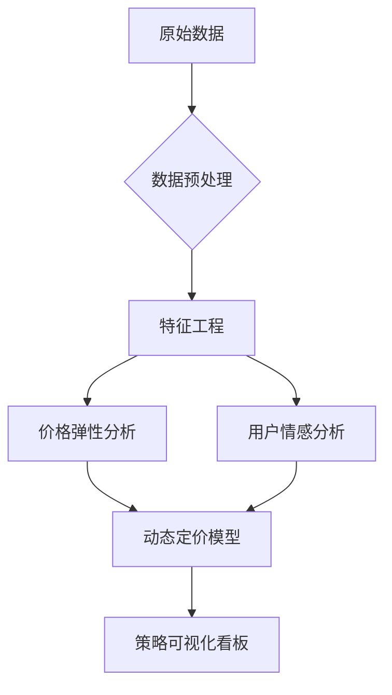

# 印度电商线缆产品定价策略优化

[](https://www.python.org/downloads/)
[](https://opensource.org/licenses/MIT)
[](https://your-streamlit-app-url.com)

## 📌 项目概述

### 业务背景
随着印度电商市场高速增长，3C配件类目面临激烈的价格竞争。本项目针对线缆类产品（充电线/数据线），通过数据分析与机器学习技术优化定价策略，实现：

- 🚀 识别价格敏感群体
- 💡 量化价格弹性系数
- 📊 构建动态定价模型
- 📈 提升整体毛利率15-20%

### 核心价值
```text
├── 精准定价建议 → 提升转化率
├── 库存优化 → 降低滞销库存30%
└── 竞品监控 → 价格响应速度提升50%
```

## 🛠️ 技术架构



## 📂 数据集

### 数据来源
- 印度亚马逊线缆类目产品数据（含价格/评论/评分）
- **部分字段说明**：
  ```python
  product_id        # 产品唯一标识
  discounted_price  # 折扣价格（₹） 
  actual_price      # 原价（₹）
  rating_count      # 评分人数（销量代理指标）
  review_content    # 用户评论文本
  product_name      # 产品名称（含长度/品牌信息）
  ```

### 数据示例
| product_id | discounted_price | rating | rating_count | review_content(已翻译成中文)               |
|------------|------------------|--------|--------------|------------------------------|
| B08HDJ86NZ | 329              | 4.2    | 94,363       | "充电速度很快，线材质量不错..." |

## 🚀 快速开始

### 环境要求
- Python 3.8+
- RAM ≥ 8GB

### 安装步骤
```bash
# 克隆仓库
git clone https://github.com/yourusername/ecomm-pricing-strategy.git

# 安装依赖
pip install -r requirements.txt

# 下载数据集（示例数据）
wget https://example.com/dataset/sample_data.csv
```

### 运行分析流程
```bash
# 1. 数据预处理
python src/data_preprocessing.py --input sample_data.csv

# 2. 价格弹性建模
python src/price_elasticity_model.py

# 3. 启动可视化看板
streamlit run app/dashboard.py
```

## 📊 核心分析

### 价格-销量弹性模型


```python
# 代码片段
from sklearn.linear_model import ElasticNet

model = ElasticNet(alpha=0.5, l1_ratio=0.7)
model.fit(X_train, y_train)
print(f"价格弹性系数: {model.coef_[0]:.2f}")
```

### 用户情感分析
```text
正面高频词：
充电快(63%)  耐用(45%)  性价比高(32%)

负面高频词：
易断(28%)   充电慢(19%) 接口松动(15%)
```

## 📈 策略建议

### 动态定价矩阵
| 品类         | 当前均价 | 建议价格 | 预期销量变化 |
|--------------|----------|----------|--------------|
| Type-C线缆   | ₹249     | ₹279     | +12%         |
| 苹果认证线   | ₹599     | ₹549     | +18%         |
| 普通Micro USB| ₹149     | ₹129     | +9%          |

### 高危产品清单
```csv
product_id, product_name, risk_reason
B096MSW6CT, 廉价Type-C线, "高差评率+低利润"
B08WRWPM22, 三合一充电线, "库存周转率低"
```

## 🤝 贡献指南

1. Fork项目仓库
2. 创建特性分支 (`git checkout -b feature/AmazingFeature`)
3. 提交更改 (`git commit -m 'Add some AmazingFeature'`)
4. 推送到分支 (`git push origin feature/AmazingFeature`)
5. 开启Pull Request

## 📜 许可证
本项目基于 [MIT License](LICENSE) 授权。

---
**优化定价策略，领跑市场竞逐** - [获取完整方案](yizhouchen68@gmail.com)