# 跨境电商产品定价策略优化

[](https://www.python.org/downloads/)
[](https://opensource.org/licenses/MIT)
[](https://streamlit.io)

## 📌 项目概述

### 业务背景
随着印度电商市场高速增长，3C配件类目面临激烈的价格竞争。本项目针对线缆类产品（充电线/数据线），通过数据分析与机器学习技术优化定价策略，实现：

- 🚀 识别价格敏感群体
- 💡 量化价格弹性系数
- 📊 构建动态定价模型
- 📈 提升整体毛利率15-20%

### 核心价值
```text
├── 精准定价建议 → 提升转化率
├── 库存优化 → 降低滞销库存30%
└── 竞品监控 → 价格响应速度提升50%
```

## 🛠️ 技术架构

```mermaid
graph TD
    A[原始数据] --> B{数据预处理}
    B --> C[特征工程]
    C --> D[价格弹性分析]
    C --> E[用户情感分析]
    D --> F[动态定价模型]
    E --> F
    F --> G[策略可视化看板]
```



## 📂 数据集

### 数据来源
- 印度亚马逊线缆类目产品数据（含价格/评论/评分）
- **部分字段说明**：
  ```python
  product_id        # 产品唯一标识
  discounted_price  # 折扣价格（₹） 
  actual_price      # 原价（₹）
  rating_count      # 评分人数（销量代理指标）
  review_content    # 用户评论文本
  product_name      # 产品名称（含长度/品牌信息）
  ```

### 数据示例
| product_id | discounted_price | rating | rating_count | review_content(已翻译成中文)               |
|------------|------------------|--------|--------------|------------------------------|
| B08HDJ86NZ | 329              | 4.2    | 94,363       | "充电速度很快，线材质量不错..." |

## 🚀 快速开始

### 项目结构
```
ecomm-pricing-strategy/
├── data/                # 数据文件
│   └── amazon.csv
├── src/                 # 源代码
│   ├── data_preprocessing.py
│   ├── price_elasticity.py
│   ├── sentiment_analysis.py
│   ├── pricing_model.py
│   └── dashboard.py
├── outputs/             # 输出结果
│   └── report.txt
├── docs/                # 文档
│   └── images/
├── requirements.txt     # 依赖包
└── README.md
```

### 环境要求
- Python 3.8+
- RAM ≥ 8GB

### 安装步骤
```bash
# 克隆仓库
git clone https://github.com/yourusername/ecomm-pricing-strategy.git

# 安装依赖
pip install -r requirements.txt

# 下载数据集（示例数据）
wget https://example.com/dataset/sample_data.csv
```

### 运行分析流程
```bash
# 1. 数据预处理
python src/data_preprocessing.py --input sample_data.csv

# 2. 价格弹性建模
python src/price_elasticity_model.py

# 3. 启动可视化看板
streamlit run app/dashboard.py
```

## 📊 核心分析

### 价格-销量弹性模型
[价格弹性分析]

```python
# 代码片段
from sklearn.linear_model import ElasticNet

model = ElasticNet(alpha=0.5, l1_ratio=0.7)
model.fit(X_train, y_train)
print(f"价格弹性系数: {model.coef_[0]:.2f}")
```

### 用户情感分析
```text
正面高频词：
充电快(63%)  耐用(45%)  性价比高(32%)

负面高频词：
易断(28%)   充电慢(19%) 接口松动(15%)
```

## 📈 策略建议

### 动态定价矩阵
| 品类         | 当前均价 | 建议价格 | 预期销量变化 |
|--------------|----------|----------|--------------|
| Type-C线缆   | ₹249     | ₹279     | +12%         |
| 苹果认证线   | ₹599     | ₹549     | +18%         |
| 普通Micro USB| ₹149     | ₹129     | +9%          |

### 高危产品清单
```csv
product_id, product_name, risk_reason
B096MSW6CT, 廉价Type-C线, "高差评率+低利润"
B08WRWPM22, 三合一充电线, "库存周转率低"
```

## 🤝 贡献指南

### 开发流程
1. 配置开发环境
```bash
# 创建虚拟环境
python -m venv venv
source venv/bin/activate  # Windows: venv\Scripts\activate

# 安装开发依赖
pip install -r requirements.txt
```

2. 运行测试
```bash
python -m pytest tests/
```

3. 代码规范
- 遵循 PEP 8 规范
- 使用类型注解
- 编写单元测试

### 提交规范
- feat: 新功能
- fix: 修复问题
- docs: 文档变更
- style: 代码格式
- refactor: 代码重构
- test: 测试相关
- chore: 其他修改

1. Fork项目仓库
2. 创建特性分支 (`

## 📜 许可证

## 📝 更新日志

### [1.0.0] - 2024-01-10
#### 新增
- 完整的数据分析流程
- 交互式数据看板
- 价格弹性模型

#### 优化
- 提升模型准确率
- 优化UI交互体验

#### 修复
- 修复数据预处理中的异常值处理
- 修复情感分析准确性问题

本项目基于 [MIT License](LICENSE) 授权。

## 📮 问题反馈

- 提交 Issue: [GitHub Issues](https://github.com/jasonchen1001/ecomm-pricing-strategy/issues)
- 邮件联系: yizhouchen68@gmail.com

**优化定价策略，领跑市场竞逐** - [获取完整方案](yizhouchen68@gmail.com)